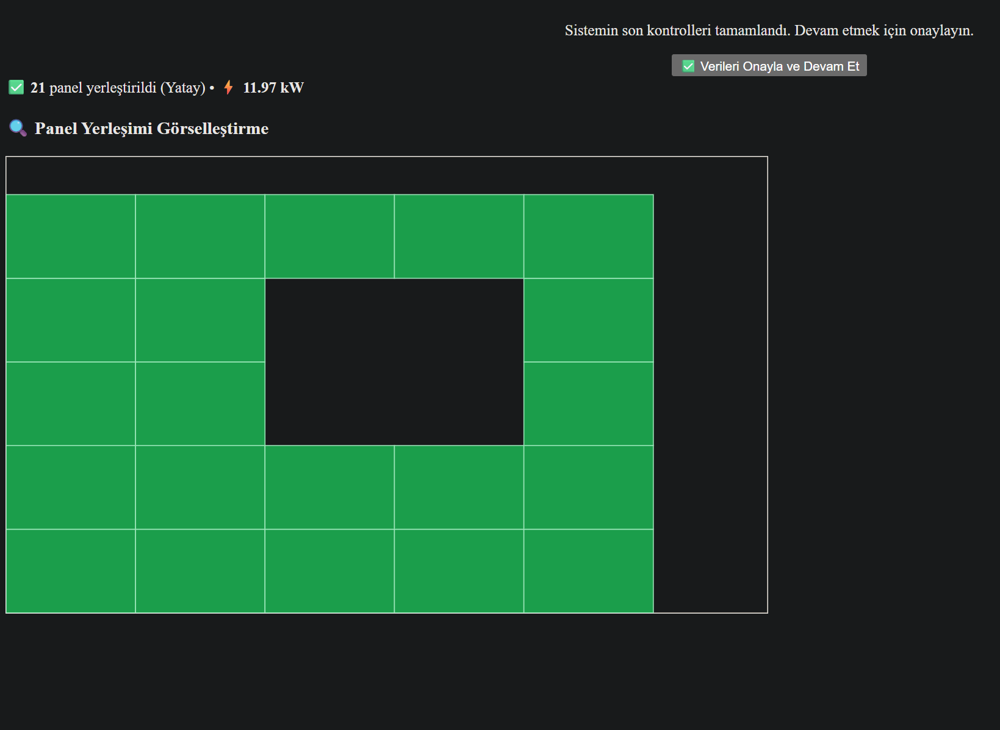

# ☀️ SolarOptimizer360 – Güneş Paneli Yerleşim Yardımcısı / Solar Panel Layout Assistant

## 🇹🇷 Türkçe Açıklama

SolarOptimizer360, çatılar üzerindeki engellere göre yapay zekâ destekli en uygun güneş paneli yerleşimini hesaplar ve SVG ile görselleştirir.

### 🚀 Yeni Özellikler

- ⚡ Yapay zekâ destekli panel yerleşim algoritması
- 🧱 Engel tespiti ve çakışma kontrolü (baca, klima, pencere vs.)
- 🖼️ SVG ile çatı üstü panel yerleşim görselleştirmesi
- 💾 LocalStorage üzerinden oturum takibi ve veri kaydı
- ✅ Eski engellerin otomatik temizlenmesi

### 📷 Panel Çizimi Örneği

---

## 🇬🇧 English Description

SolarOptimizer360 is an AI-powered web tool to calculate the optimal solar panel layout based on roof obstacles and visualize the result using SVG.

### 🚀 New Features

- ⚡ AI-powered panel placement algorithm
- 🧱 Obstacle-aware layout (chimneys, air units, skylights etc.)
- 🖼️ SVG-based rooftop layout visualization
- 💾 Session tracking and state persistence via LocalStorage
- ✅ Auto-clearing of outdated obstacle data

### 📷 Sample Layout View

